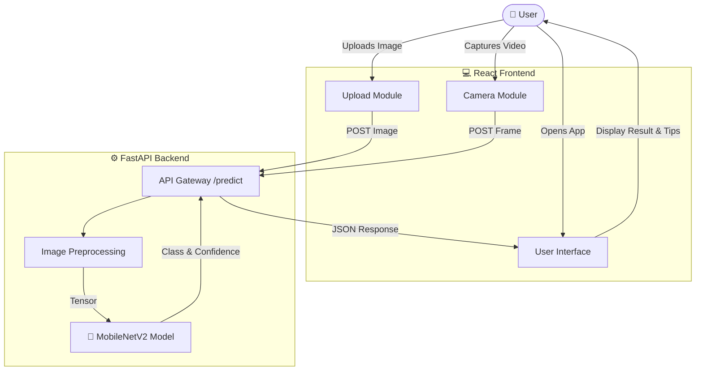

# ♻️ Smart Waste Detection and Segregation Platform

An AI-powered web application that automatically classifies waste into categories (plastic, paper, glass, organic, etc.) using deep learning. This platform helps users identify waste types and provides proper disposal and recycling instructions to promote sustainable waste management.


---

## 📋 Table of Contents
- [Problem Statement](#-problem-statement)
- [Objectives](#-objectives)
- [System Architecture](#-system-architecture)
- [Technologies Used](#-technologies-used)
- [Features](#-features)
- [Installation & Setup](#-installation--setup)
- [Usage](#-usage)
- [Project Structure](#-project-structure)
- [Future Scope](#-future-scope)

---

## 🌍 Problem Statement

Municipal Solid Waste (MSW) is a growing global crisis. Improper segregation leads to:
- Reduced recycling efficiency
- Increased landfill overflow
- Environmental contamination
- Health hazards for sanitation workers

Manual segregation is labor-intensive and error-prone. There is a critical need for an **automated, intelligent solution** to assist in waste sorting at the source.

---

## 🎯 Objectives

1. **AI-Powered Classification**: Detect and classify waste (Battery, Biological, Cardboard, Clothes, Glass, Metal, Paper, Plastic, Shoes, Trash) with high accuracy using MobileNetV2.
2. **Real-Time Interaction**: Provide a user-friendly web interface for instant image uploads and live camera detection.
3. **Educational Impact**: Offer immediate disposal and recycling guidance to encourage responsible waste habits.

---

## 🏗 System Architecture

The system follows a client-server architecture where the React frontend captures images and sends them to a FastAPI backend for inference.



---

## 🛠 Technologies Used

| Component | Technology | Version | Purpose |
|-----------|------------|---------|---------|
| **Backend** | Python | 3.10.11 | Core language |
| | FastAPI | 0.124.0 | High-performance API framework |
| | Uvicorn | 0.38.0 | ASGI Server |
| | TensorFlow | 2.12.0 | Deep Learning framework |
| | Pillow | 12.0.0 | Image processing |
| **Frontend** | React.js | 19.2.0 | UI Library |
| | Axios | 1.13.2 | HTTP Client |
| | React Webcam | 7.2.0 | Camera integration |
| **DevOps** | Git | - | Version Control |
| | Windows Batch | - | Automation Scripts |

---

## ✨ Features

📸 Image Upload: Upload existing images from your device for classification.

🎥 Live Camera Detection: Real-time waste detection using your device's webcam.

⚡ Fast Inference: Powered by MobileNetV2 for quick and efficient predictions.

♻️ Smart Guidance: Displays carbon footprint, disposal methods, and recycling tips for each detected class.

🤖 AI Chatbot Assistant: Ask questions about waste disposal, recycling, and sustainability with an AI-powered assistant.

📱 Responsive Design: Works smoothly on both desktop and mobile devices.

---

## 🚀 Installation & Setup

### Prerequisites
- **Python 3.10** (Recommended for TensorFlow 2.12 compatibility)
- **Node.js** (v18 or higher)

### One-Click Start (Windows)
We have provided a batch script to automate the setup and startup process.
1. Navigate to the project root.
2. Double-click **`start-dev.bat`**.
   - This will create a virtual environment, install dependencies, and start both Backend and Frontend servers.

### Manual Setup

#### 1. Backend Setup
```bash
cd backend
# Create virtual environment
py -3.10 -m venv .venv
# Activate environment (Windows)
.\.venv\Scripts\Activate
# Install dependencies
pip install -r requirements.txt
# Start Server
python -m uvicorn app:app --host 0.0.0.0 --port 8000 --reload
```

#### 2. Frontend Setup
```bash
cd frontend/waste-frontend
# Install dependencies
npm install
# Start React App
set REACT_APP_API_URL=http://localhost:8000 && npm start
```

For more detailed instructions, see [start.md](./start.md).

---

## 📖 Usage

1. **Start the Application**: Ensure both backend (port 8000) and frontend (port 3000) are running.
2. **Open Browser**: Go to `http://localhost:3000`.
3. **Select Mode**:
   - **Upload Mode**: Click "Upload Mode", select an image, and click "Detect Waste".
   - **Camera Mode**: Click "Camera Mode", allow permissions, and point your camera at the waste item.
4. **View Results**: The system will display the waste type, confidence score, and disposal instructions.

---

## 📂 Project Structure

```
Smart-Waste-Detection-and-Segregation-Platform/
├── backend/                 # FastAPI Server
│   ├── model/               # Trained AI Models (.h5)
│   ├── app.py               # Main Application Entry
│   └── requirements.txt     # Python Dependencies
├── frontend/                # React Application
│   └── waste-frontend/
│       ├── src/             # Source Code (App.js, CSS)
│       ├── public/          # Static Assets
│       └── package.json     # Node Dependencies
├── model_training/          # Training Scripts & Notebooks
├── start-dev.bat            # One-click startup script
├── start.md                 # Detailed startup guide
└── README.md                # Project Documentation
```

---

## 🔮 Future Scope

- **Dataset Expansion**: Incorporate more diverse waste images to improve accuracy.
- **Mobile App**: Develop a native mobile application (React Native/Flutter).
- **Geospatial Integration**: Map nearby recycling centers based on user location.
- **User Accounts**: Track personal recycling history and gamify the experience.

---

## 🤝 Credits & Acknowledgements

- **Dataset**: Garbage Dataset
- **Supervisor**: Dr. Amit Kumar
- **Team**:
Group No.: 4

Team Members
Tanvi Utreja(221030037) 
Ayush Rawat (221030205)
Mehak Sharma (221030157)
Mahua Vaidya (221030396)


---
