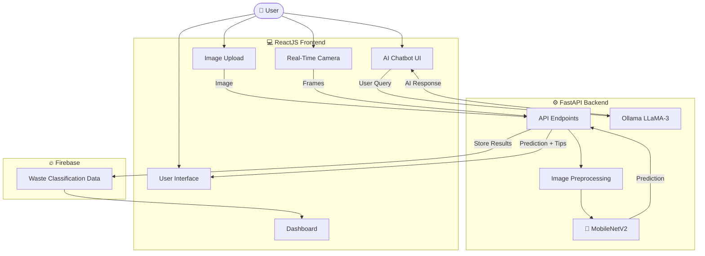

# ♻️ Smart Waste Detection and Segregation Platform

An AI-powered web application that automatically classifies waste into categories using Deep Learning and Computer Vision. The platform supports image upload, real-time camera detection, dashboard analytics, and AI-powered waste guidance to promote sustainable waste management.


---

## 📋 Table of Contents

- [Problem Statement](#-problem-statement)
- [Objectives](#-objectives)
- [System Architecture](#-system-architecture)
- [Technologies Used](#-technologies-used)
- [Features](#-features)
- [Live Deployment](#-live-deployment)
- [Installation & Setup](#-installation--setup)
- [Usage](#-usage)
- [Project Structure](#-project-structure)
- [Future Scope](#-future-scope)
- [Credits & Acknowledgements](#-credits--acknowledgements)

---

## 🌍 Problem Statement

Municipal Solid Waste (MSW) is a growing global challenge. Improper waste segregation leads to:

- Reduced recycling efficiency
- Landfill overflow
- Environmental pollution
- Health risks for sanitation workers

Manual waste segregation is time-consuming and error-prone. Therefore, there is a need for an intelligent AI-based system that can automate waste classification and provide proper disposal guidance.

---

## 🎯 Objectives

1. **AI-Based Waste Classification:**  
   Detect and classify waste into 10 categories using MobileNetV2.

2. **Real-Time Detection:**  
   Support both image upload and live camera-based waste detection.

3. **Waste Awareness & Guidance:**  
   Provide recycling suggestions, disposal methods, and environmental insights.

4. **Analytics & Monitoring:**  
   Visualize classified waste data through a dashboard connected with Firebase.

5. **Interactive Assistance:**  
   Integrate an AI chatbot for answering waste disposal and recycling queries.

---

## 🏗 System Architecture

The platform follows a client-server architecture where the ReactJS frontend communicates with the FastAPI backend for waste classification, dashboard analytics, and chatbot interaction.



---

## 🛠 Technologies Used

| Component | Technology | Purpose |
|-----------|------------|---------|
| **Backend** | Python, FastAPI, Uvicorn | API Development & Model Integration |
| **Frontend** | ReactJS, Axios, React-Webcam | User Interface & Camera Integration |
| **AI/ML** | TensorFlow, Keras, MobileNetV2 | Waste Classification |
| **Database** | Firebase | Store Classified Waste Data |
| **Chatbot** | Ollama + LLaMA-3 | Waste Guidance Assistant |
| **Deployment** | Render, Vercel | Cloud Hosting |
| **Version Control** | Git & GitHub | Collaboration & Repository Management |

---

## ✨ Features

📸 **Image Upload:** Upload waste images from your device for instant classification.

🎥 **Live Camera Detection:** Detect waste in real time using webcam integration.

⚡ **Fast AI Inference:** MobileNetV2 provides lightweight and efficient predictions.

♻️ **Smart Waste Guidance:** Displays recycling suggestions, disposal methods, and environmental impact information.

📊 **Dashboard Analytics:** Visualizes classified waste data and category distribution using Firebase.

🤖 **AI Chatbot Assistant:** Integrated Ollama + LLaMA-3 chatbot for waste disposal and recycling queries.

☁️ **Cloud Deployment:** Frontend deployed on Vercel and backend deployed on Render.

📱 **Responsive UI:** Smooth experience across desktop and mobile devices.

---

## 🌐 Live Deployment

- **Frontend (Vercel):** https://your-vercel-link.vercel.app  
- **Backend (Render):** https://your-render-backend.onrender.com  

---

## 🚀 Installation & Setup

### Prerequisites

- Python 3.10
- Node.js (v18 or higher)
- Firebase Configuration
- Ollama Installed Locally

---

### Backend Setup

```bash
cd backend

# Create virtual environment
py -3.10 -m venv .venv

# Activate virtual environment
.\.venv\Scripts\activate

# Install dependencies
pip install -r requirements.txt

# Start FastAPI server
uvicorn app:app --reload
```

Backend runs on:

```bash
http://localhost:8000
```

---

### Frontend Setup

```bash
cd frontend/waste-frontend

# Install dependencies
npm install

# Start React frontend
npm start
```

Frontend runs on:

```bash
http://localhost:3000
```

---

### Ollama Setup (Chatbot)

Install Ollama and run the LLaMA-3 model locally:

```bash
ollama run llama3
```

---

## 📖 Usage

1. Start backend and frontend servers.
2. Open the application in your browser.
3. Upload an image or use real-time camera mode.
4. View:
   - Waste category
   - Confidence score
   - Recycling and disposal suggestions
5. Open dashboard for analytics visualization.
6. Use AI chatbot for waste-related queries.

---

## 📂 Project Structure

```bash
Smart-Waste-Detection-and-Segregation-Platform/
│
├── backend/
│   ├── model/
│   ├── app.py
│   ├── chatbot.py
│   └── requirements.txt
│
├── frontend/
│   └── waste-frontend/
│       ├── src/
│       │   ├── components/
│       │   ├── pages/
│       │   └── App.js
│       └── package.json
│
├── model_training/
├── firebase/
├── README.md
└── .gitignore
```

---

## 🔮 Future Scope

- Add more waste categories and larger datasets.
- Optimize the model using TensorFlow Lite.
- Integrate IoT-enabled smart waste bins.
- Improve dashboard analytics and visualization.
- Add multilingual and voice-enabled chatbot support.

---

## 🤝 Credits & Acknowledgements

- **Dataset:** Garbage Dataset  
- **Supervisor:** Dr. Amit Kumar  

### Team Members

- Tanvi Utreja (221030037)  
- Mehak Sharma (221030157)  
- Mahua Vaidya (221030396)

---